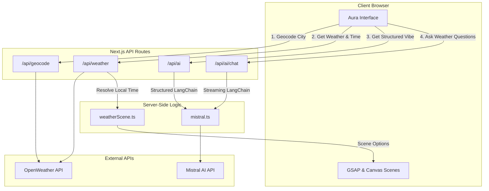
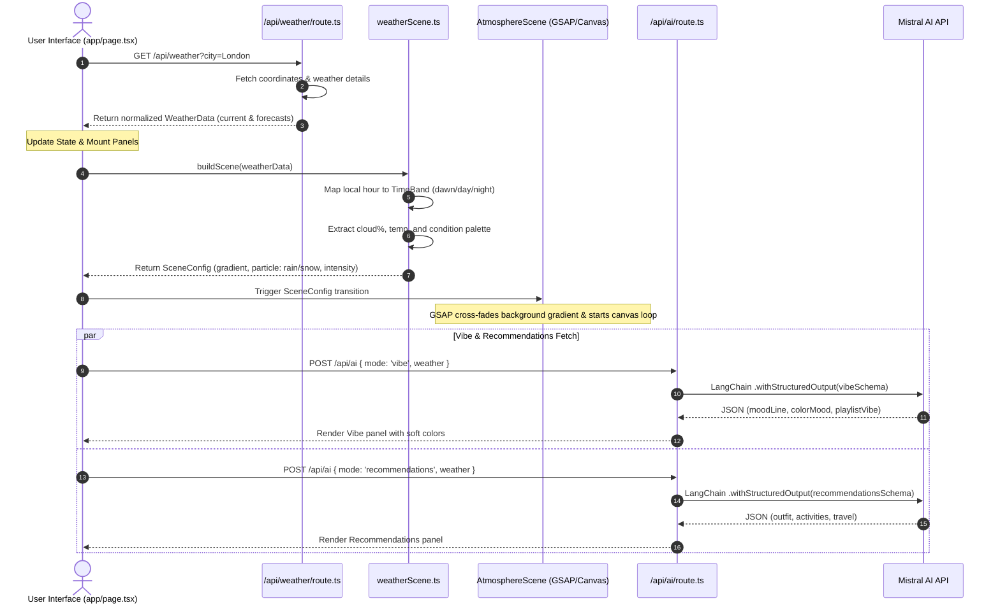

# Aura Weather AI-Powered App — Architecture & Interview Preparation Guide

This document contains a detailed analysis of the **Aura (Weather AI powered app)** system architecture, data flows, Canvas/GSAP animation details, LangChain.js + Mistral integration patterns, and interview preparation questions.

---

## 🏗️ 1. System Architecture & Directory Layout

Aura is a Next.js 15 application utilizing React, Tailwind CSS v4, GSAP, and LangChain.js.

### Workspace Structure
*   **`app/`**: Next.js App Router setup.
    *   `page.tsx`: Client-side orchestrator handling user location inputs, fetching coordinates, mounting panels, and loading the animation scene.
    *   `api/geocode/route.ts`: Autocomplete geocoding API proxy connecting to the OpenWeather Geocoding API.
    *   `api/weather/route.ts`: Aggregator API fetching and normalizing current conditions + 5-day/3-hour forecasts.
    *   `api/ai/route.ts`: API route executing structured outputs via LangChain (AI vibe and smart recommendations).
    *   `api/ai/chat/route.ts`: Edge-friendly streaming chat API handler connecting to Mistral.
*   **`components/`**: React visual layers.
    *   `AtmosphereScene.tsx`: Manages the GSAP canvas orchestrator and layers: `SkyGradient`, `CelestialLayer`, `CloudLayer`, `PrecipitationCanvas`, `FogLayer`, and `LightningLayer`.
    *   `ai/`: Houses `VibePanel`, `RecommendationsPanel`, and `ChatPanel`.
*   **`lib/`**: Business logic.
    *   `openweather.ts`: Integrates with OpenWeather API endpoints.
    *   `weatherScene.ts`: Maps raw conditions (temp, clouds, precipitation type) and local hour into specific color palettes and particle animation variables.
    *   `mistral.ts`: Connects to ChatMistralAI via LangChain, defining Structured Output schemas and chat parameters.

---

## 📊 2. Architectural Diagrams

### A. High-Level Data Flow

This diagram shows how client requests flow to server-side API Routes and resolve to external OpenWeather and Mistral AI endpoints:



---

### B. End-to-End Search & Animation Sequence

This sequence diagram traces the complete lifecycle of a city search. It illustrates how live weather data updates the GSAP canvas scene while concurrently loading structured vibe analysis and recommendations from the AI:



---

## 🎨 3. Atmosphere & Animation Rendering System

### Dynamic Sky Palette System
*   **Time-Bands**: Cities are assigned one of 5 time bands based on their current local hour: `dawn` (5:00–7:59), `day` (8:00–16:59), `golden` (17:00–18:59), `dusk` (19:00–20:59), or `night` (21:00–4:59).
*   **SkyGradients**: Linear backgrounds dynamically blend top, mid, and bottom hex values (e.g. dawn uses `#1e2a52` $\to$ `#5b6aa8` $\to$ `#f6b48a`).
*   **Condition Overrides**: In stormy, snowy, or foggy conditions, colors are dynamically desaturated and darkened (Storm palette uses `#06070d` $\to$ `#181a2b` $\to$ `#33324a`).

### Canvas Particle Loops
*   **`PrecipitationCanvas`**: Runs a requestAnimationFrame loop that renders rain drops (angled lines with variable velocity and length) or snow flakes (drifting circles with sinusoidal horizontal sway).
*   **Reduced Motion**: Utilizes React contexts to monitor standard browser accessibility queries. If `prefers-reduced-motion` is active:
    *   Rain and snow canvas render loops are killed.
    *   Cloud animations are locked in place.
    *   Celestial transitions fall back to instant CSS color fades.

---

## 🧠 4. LangChain.js & Mistral Integrations

### Structured Outputs
*   **Zod Schema Enforcement**: LangChain maps Zod objects to model tool declarations behind the scenes, forcing Mistral to output schema-aligned arguments (via function calling).
*   **Vibe Parsing**: Maps context containing location, local hour, temperature, wind, and description to output an evocative summary, mood color code, and playlist description.
*   **Recommendations**: Returns activity arrays tailored to whether it is raining, cold, or dark in the target city.

### Chat Streaming (Ask Aura)
*   **Context Grounding**: The assistant is locked to system prompt instructions: *Answer using ONLY the live weather context provided*. If a query falls outside the bounds of the provided data, the assistant politely declines.
*   **Readable Stream**: Reads chunks asynchronously from `ChatMistralAI.stream(messages)` and enqueues UTF-8 encoded blocks onto a Next.js `ReadableStream` response.

---

## 📝 5. Technical Practice Interview Questions & Answers

### Q1: How does structured output generation (`.withStructuredOutput()`) work under the hood in LangChain.js, and how does the backend guarantee Mistral outputs conform to Zod?
**Answer:**
Under the hood, LangChain converts the Zod schemas (`vibeSchema` and `recommendationsSchema`) into a JSON Schema format (such as OpenAI/Mistral tool/function declarations). It passes this schema as a tool definition in the API request payload, instructing the LLM to invoke the tool using arguments matching the schema.
Mistral generates tool call arguments rather than arbitrary conversational text. Once returned, LangChain parses the arguments and returns them as typed JavaScript objects. If the model output is corrupted or fails verification, the validator throws a parsing error, which can be captured and handled gracefully.

---

### Q2: In `app/api/ai/chat/route.ts`, we stream chat tokens back to the client. What is the transport mechanism, and how does the client process these stream chunks?
**Answer:**
The server creates a standard HTTP response with `Content-Type: text/plain; charset=utf-8` and `Cache-Control: no-store` (disabling edge buffering). In Node.js, Next.js handles this by executing HTTP chunked transfer encoding (`Transfer-Encoding: chunked`), keeping the socket open and sending packets down as they arrive.
On the client side, the UI calls `fetch` and accesses `response.body.getReader()`. It runs a recursive loop reading stream chunks:
```typescript
const reader = response.body.getReader();
const decoder = new TextDecoder();
while (true) {
  const { done, value } = await reader.read();
  if (done) break;
  const chunkText = decoder.decode(value);
  // append chunkText to UI chat log
}
```

---

### Q3: How does Aura fetch and calculate the correct local hour and time band (e.g. dawn, dusk) of a queried city when the server resides in a different timezone?
**Answer:**
OpenWeather responses contain a `timezone` offset (seconds relative to UTC). To calculate local time without querying secondary third-party APIs:
1.  Get the current system time in UTC (e.g. `Date.now()`).
2.  Add the `timezone` offset value (converted to milliseconds) to get the local timestamp.
3.  Construct a Date object using the calculated timestamp and convert it to UTC time strings to isolate the correct local hour, avoiding local host machine timezone offsets:
```typescript
const localTimeMs = Date.now() + timezoneOffsetSeconds * 1000;
const localDate = new Date(localTimeMs);
const localHour = localDate.getUTCHours();
```

---

### Q4: Explain the differences in temperature settings between the `generateVibe` (0.8) and `generateRecommendations` (0.4) methods, and the logic behind them.
**Answer:**
*   **0.8 Temperature (generateVibe)**: Increases output token entropy, producing more diverse, creative, and evocative adjectives, which is ideal for describing weather atmospheres, moods, and musical vibes.
*   **0.4 Temperature (generateRecommendations)**: Encourages conservative, grounded, and factual token selections. This is optimal for recommending practical outfits (e.g., heavy coats when freezing) and safe travel/commute guidelines, where creative output is secondary to correctness.

---

### Q5: The rain/snow animation loop in `PrecipitationCanvas` runs on HTML5 Canvas. Why is this more performant than using standard DOM nodes or SVGs for each particle?
**Answer:**
Updating thousands of individual DOM elements (HTML nodes or SVG shapes) forces the browser to run expensive reflow and repaint calculations for every frame, degrading performance.
HTML5 Canvas uses an immediate rendering context. Particles are simulated purely in-memory as Javascript objects. On each frame, the canvas is cleared (`ctx.clearRect()`) and drawn onto directly in a single layout pass. This bypasses the DOM completely, allowing browsers to render thousands of moving particles at a stable 60 FPS.

---

### Q6: Next.js 15 route caching is enabled by default. How is `/api/weather` configured to guarantee users always receive live current weather metrics rather than cached page outputs?
**Answer:**
Next.js caches route handler outputs unless explicitly marked otherwise. To ensure live conditions are fetched:
1.  Configure the runtime exports at the top of the route file: `export const dynamic = "force-dynamic";`.
2.  Ensure underlying `fetch` requests to OpenWeather are configured to bypass caching (e.g. using `fetch(url, { cache: "no-store" })` or `fetch(url, { next: { revalidate: 0 } })`).

---

### Q7: If the Mistral AI API key is missing or rate-limited, how does Aura safeguard the application from crashing on the user's end?
**Answer:**
The server-side API routes wrap AI generations in `try/catch` blocks, returning standard error payloads (`{ error: "message" }`) with a `500` status instead of crashing the process.
On the client side, components like `VibePanel` and `RecommendationsPanel` run independent HTTP requests. If the API returns an error, the panel captures it, handles the state gracefully, and renders fallback weather messages without breaking the rendering of raw OpenWeather tables (progressive enhancement).

---

### Q8: Explain how Canvas rendering loops can cause memory leaks in React if left unchecked. How does `AtmosphereScene` mitigate this?
**Answer:**
When a canvas component unmounts (e.g., when transitioning views or switching layouts), any running `requestAnimationFrame` loop or active GSAP animation triggers will continue to execute in memory, attempting to reference unmounted canvas elements, resulting in memory leaks.
**Mitigation**: The components return cleanup functions from their `useEffect` hooks. These cleanups explicitly call `cancelAnimationFrame(frameId)`, kill running GSAP timelines (`timeline.kill()`), and remove window resize or scroll event listeners.

---

### Q9: How are OpenWeather and Mistral API keys protected from being intercepted by malicious clients?
**Answer:**
API keys are stored as server-side environment variables in `.env.local` (e.g., `MISTRAL_API_KEY`), which are never prefixed with `NEXT_PUBLIC_`.
The client application never calls OpenWeather or Mistral directly. Instead, it queries internal endpoints (`/api/weather` and `/api/ai`), which fetch data from the APIs on the server side and return only normalized, sanitized JSON payloads. The API keys remain on the server and are never exposed to the browser.

---

### Q10: How would you scale Aura to handle weather alerts/push notifications for user locations in the background?
**Answer:**
To process background alerts:
1.  **State Management**: Create a PostgreSQL store of user-allowed locations and device subscription endpoints (using Web Push protocol).
2.  **Cron Scheduler**: Run a worker task (e.g., using BullMQ or a Cron Job) every 15–30 minutes to fetch active alerts from OpenWeather's Alerts API for all subscribed locations.
3.  **Deduplication & Push**: Store alert IDs in Redis to avoid duplicate alerts, and broadcast notifications to users via Web Push APIs.
